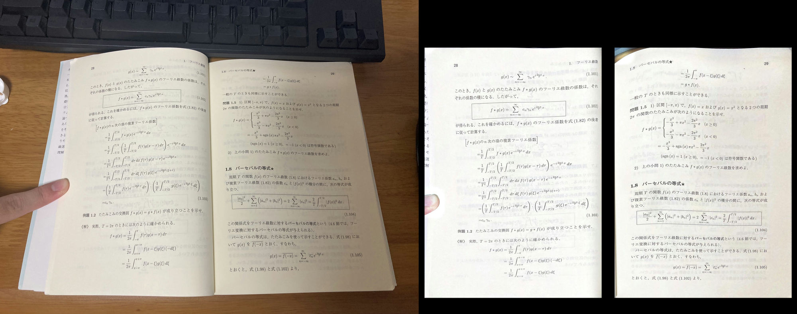

# 非破壊自炊のための画像補正

## 使い方
gui.pyを起動する。
あとは雰囲気

## 1から学習したい場合
### 訓練データセットを作成する。
```
python ./codes/make_dataset.py --save_dir=保存先ディレクトリ --img_dir=データセット作成に使う画像のディレクトリ --data_num=5000 --data_aug
```
### 検証用データセットを作成する。
```
python ./codes/make_dataset.py --save_dir=保存先ディレクトリ --img_dir=データセット作成に使う画像のディレクトリ --data_num=8
```
訓練画像の枚数(--data_num)は多ければ多いほど良い。知らんけど。

--img_dirの画像はpoppler-utilsのpdftoppmなどで適当なpdfから変換すると良い。
### 学習する
```
python train.py --train_dir=hoge --val_dir=fuga
```
必要に応じて適宜--use_wandbなどオプションを使用のこと。
## TODO
- gui.pyの改良
    - プログレスバーの実装
    - 補正に失敗した画像を個別に手動修正する機能の追加
    - CUIバージョンの追加
- model_page.pyのリファクタリング
    - UNetから各メソッドを引っこ抜いて、unetとパラメータを入力に取る関数として別途定義する
- env.yaml的なやつ用意する

上記を誰かがなんとかする。
